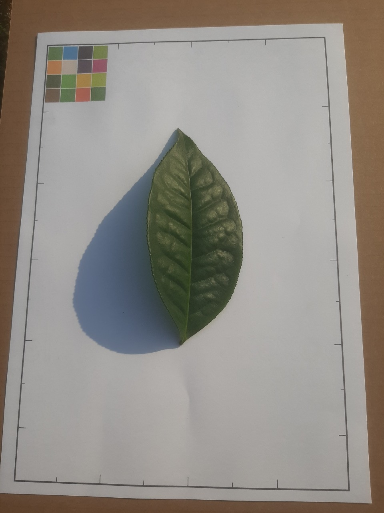
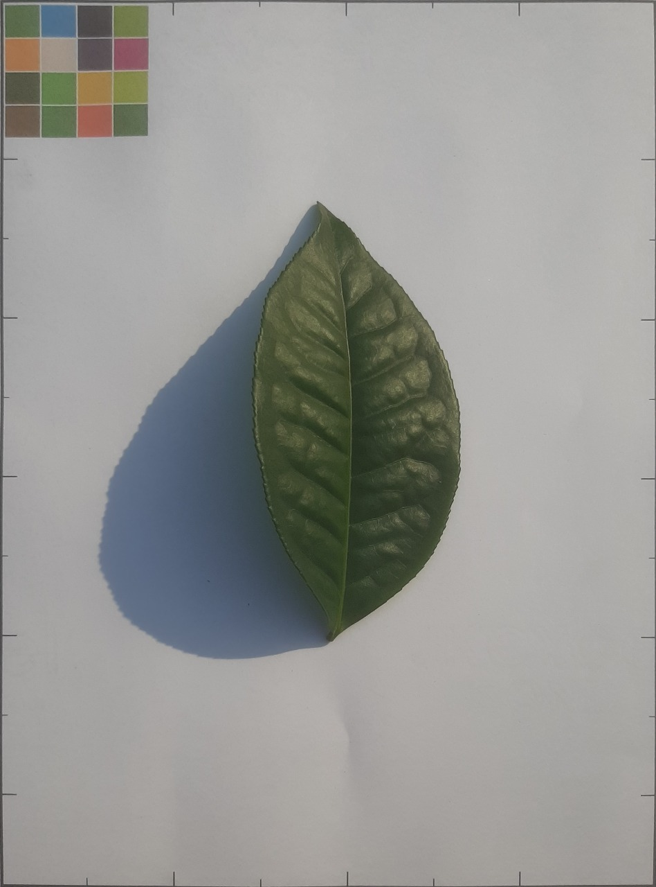

# 🍃 Tea Leaf Cultivar Pre-Processing & Classification

**Research Intern under Prof. Prabir Barooah**  
Department of Electrical and Electronics Engineering, IIT Guwahati (IITG)

---

## Project Overview
The project involves a pipeline development for **image preprocessing**, **data augmentation**, and **custom multi-layer CNN training** using **PyTorch**, aiming for high accuracy and robustness across 30 unique classes (here tea leaf cultivars).

---

## 📁 Project Structure

```
📂 Tea_Cultivar_Project/
├── CNN_Performance.pdf               # Report on CNN model performance
├── MultiLayer_CNN_Training.ipynb     # Jupyter notebook for CNN training on 3000 images
├── Preprocess_shadowremoval.ipynb    # Notebook for shadow removal preprocessing
├── Preprocessing_Pipeline_Brief.pdf  # Brief report on preprocessing pipeline being used before training a CNN
├── README.md                         # Project summary
├── assets/                           # Contains images for readme

```

---

## 🖼️ Dataset Overview

- **Total Images**: 3000+ (100 per class × 30 cultivars)
- **Input Format**: PNG images (post-processed)
- **Image Size**: 224x224 px (downsampled before training)
- **Labels**: Inferred from filenames; label = `xxx - 743`

---

## 🧪 Preprocessing Pipeline (The Crux)

<table>
  <tr>
    <td align="center">
      <br/>
      <strong>Original Leaf Image</strong><br/>
      Raw sample image before any processing.
    </td>
    <td align="center">
      <br/>
      <strong>A4 Sheet Cropping</strong><br/>
      Crops out background and aligns leaf using perspective transform.
    </td>
    <td align="center">
      <br/>
      <strong>Shadow-Free Extraction</strong><br/>
      Extracts clean leaf using HSV masking and morphological ops.
    </td>
  </tr>
</table>

---

## Some more info

- **Input**: RGB images
- **Augmentations**: Horizontal, Vertical, and HV flips (via `ConcatDataset`)
- **Loss Function**: CrossEntropyLoss
- **Optimizer**: Adam
- **Epochs**: 20
- **Batch Size**: 2

---

## Performance / Results

- **Accuracy**: **around 88%** on test set (unseen data)
- **Macro Avg F1-Score**: **0.89**
- **Weighted Avg Precision**: **0.89**
- **Training Time**: ~48 mins (20 epochs, on CPU)

### Key Observations:
- Achieved high per-class accuracy for most cultivars (e.g., Class 5, 6, 8, 10, 12, 15, 17).
- Lower accuracy observed in a few classes (e.g., Class 3, 14), indicating possible visual similarity between classes.
- Training loss fluctuated after epoch 7, could be sign of overfitting, data augmentation helped recover.
- Leaf segmentation quality directly impacted classification accuracy — effective preprocessing was key.

---

## 🛠️ Tech Stack / Libraries

- `Python 3.10+`
- `PyTorch`
- `Torchvision`
- `OpenCV`
- `scikit-learn`
- `NumPy`
- `Matplotlib`, `Seaborn`
- `PIL (Pillow)`

---

## 📌 Future Improvements

-  **Automated Hyperparameter Tuning** using Optuna.
-  Add Dropout, L2 regularization, and early stopping to reduce overfitting.
-  **Learning Rate Scheduling** for faster convergence.
-  **Deploy as Web App** using Flask or Streamlit for real-time classification.
-  **Add Additional Cultivars** and test generalization with external datasets and more unseen data.
-  **Integrate Transfer Learning** from ResNet or MobileNet, or EfficientNet for higher accuracy.

---

## 🏁 Conclusion

This project effectively demonstrates the power of **computer vision** — from raw data to preprocessing, model design, training, and evaluation.<br> 
Note: The current CNN-based classification is a basic prototype and lays the groundwork for future enhancements. The model training component is still under development by others. The primary focus of this project was to develop a robust preprocessing framework that preserves image quality and consistency before model deployment, before building real-world applications for practical use or other academic purposes.

Testimonial of completion is also present in the repo.
